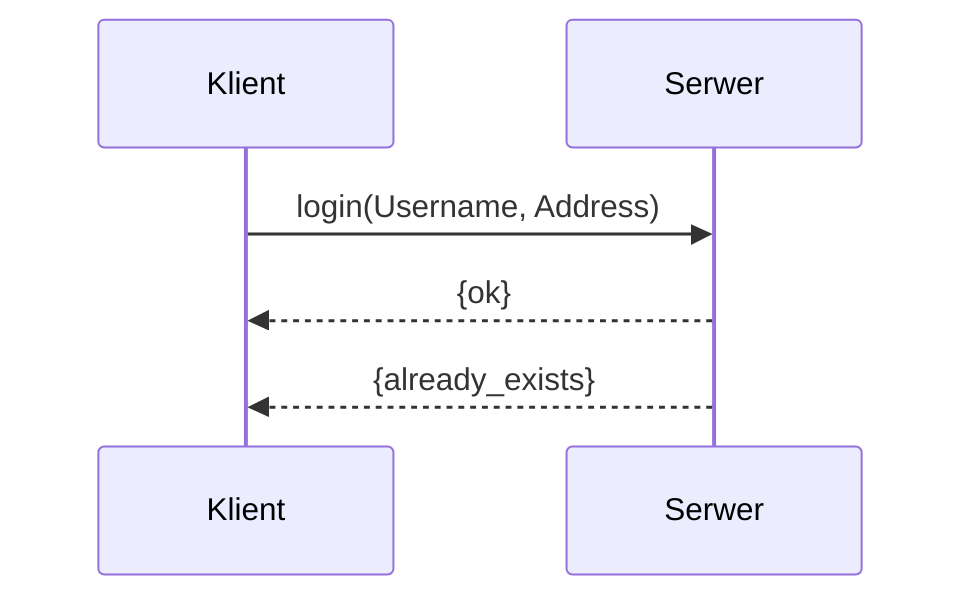
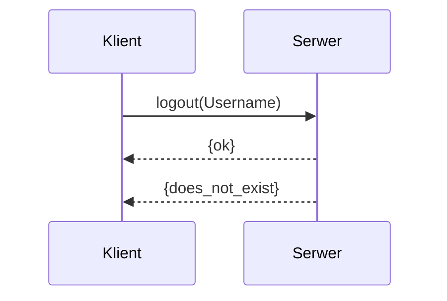

# Protokół

Niniejszy dokument zawiera opis protokołu komunikacyjnego pomiędzy serwerem a klientem.

## Sposób komunkacji

Cała komunikacja odbywa się w środowisku erlang OTP 24.3.4.

## Przesyłane komunikaty

Poniżej znajduje się opis wysyłanych komunikatów.

### Login

Klient wysyła do serwera wiadomość w postaci login(Username, Address). Jeżeli zapytanie zostało poprawnie przetworzne, serwer odpowiada "ok". Jeżeli nastąpił błąd to serwer odpowiada "already_exists".

### Logout

Klient wysyła do serwera wiadomość w postaci logout(Username). Jeżeli zapytanie zostało poprawnie przetworzne, serwer odpowiada "ok". Jeżeli nastąpił błąd to serwer odpowiada "does_not_exist".
