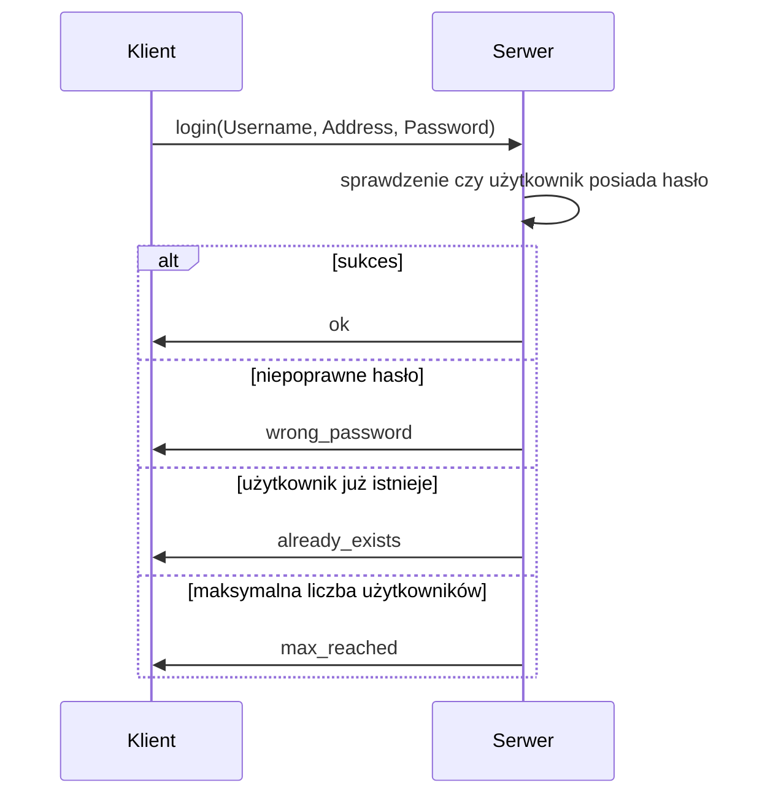
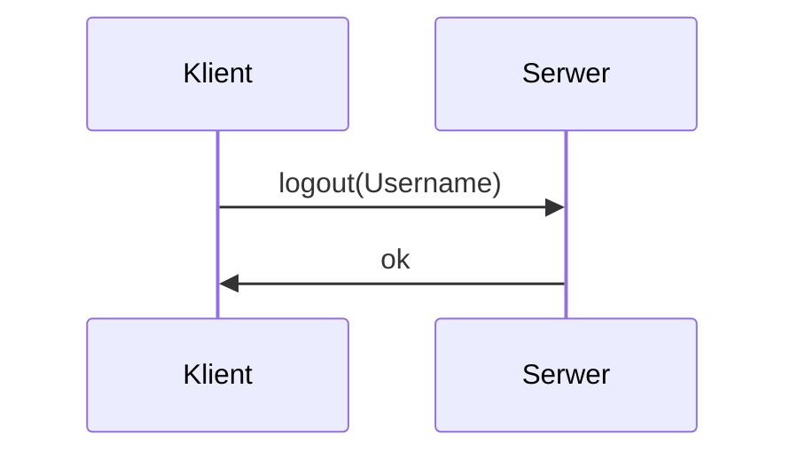
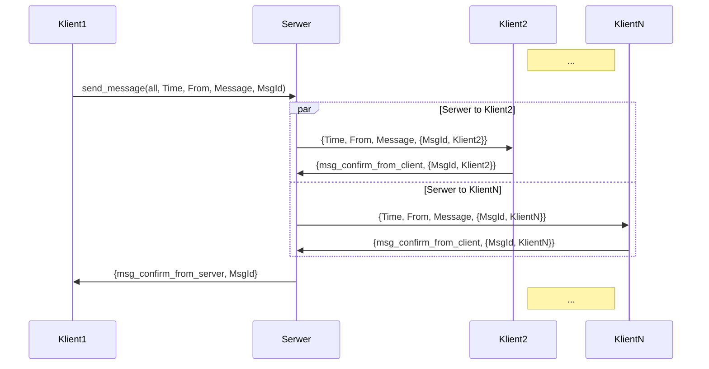
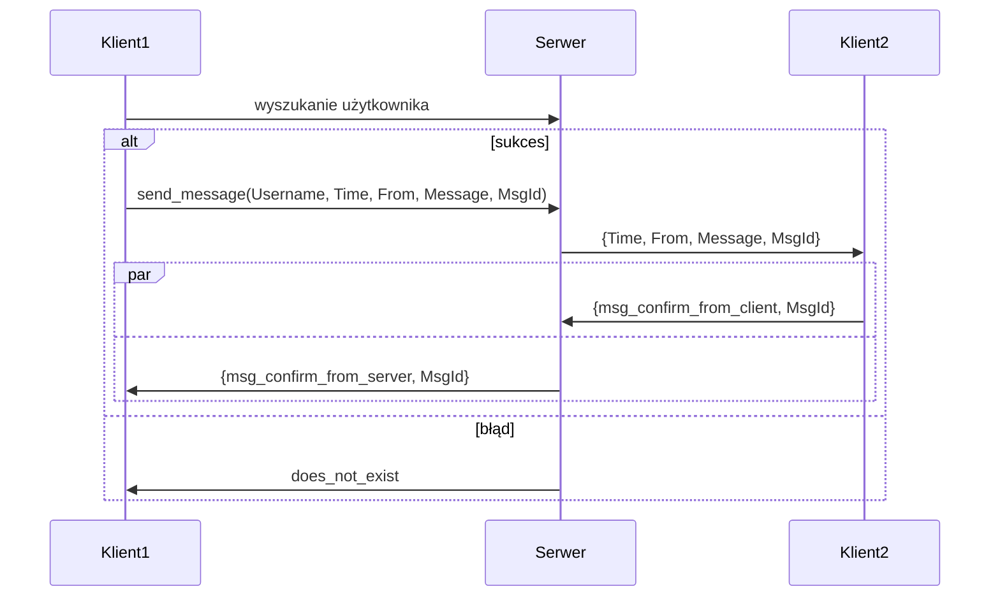
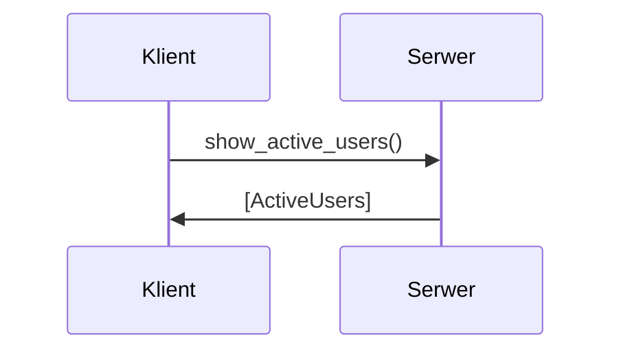
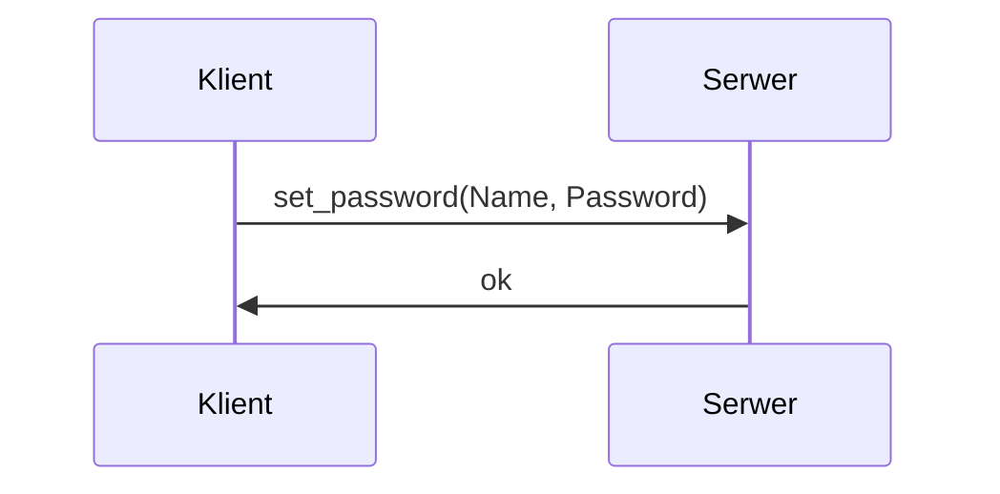
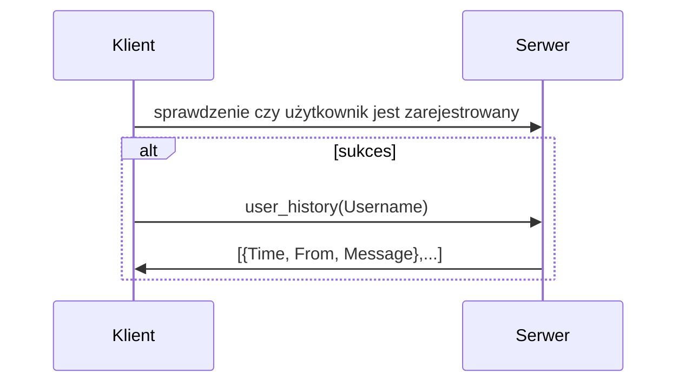

# Protokół

Niniejszy dokument zawiera opis protokołu komunikacyjnego pomiędzy serwerem a klientem.

## Sposób komunkacji

Cała komunikacja odbywa się w środowisku erlang OTP 24.3.4.

## Przesyłane komunikaty

Poniżej znajduje się opis wysyłanych komunikatów.

### login

Klient wywołuje funkcję serwera w postaci login(Username, Address, Password). Jeżeli zapytanie zostało poprawnie przetworzone, serwer odpowiada "ok". Jeżeli użytkownik o podanej nazwie już istnieje serwer odpowie "already_exists". Jeśli hasło będzie niepoprawne, serwer odpowie "wrong_password". Jeśli zostanie osiągnięta maksymalna liczba użytkowników serwer odpowie "max_reached".

### logout

Klient wywołuje funkcję serwera w postaci logout(Username). Jeżeli zapytanie zostało poprawnie przetworzne, serwer odpowiada "ok".

### send

Klient wywołuje funkcję serwera w postaci send_message(all, Time, From, Message, MsgId). Jeżeli zapytanie zostało poprawnie przetworzne, serwer wysyła wiadomość do wszystkich zalogowanych użytkowników w postaci {Time, From, Message, {MsgId, KlientN}}.

### send <Username>

Klient1 pyta serwer, czy dany użytkownik istnieje. Jeśli tak, to wywołuje funkcję serwera w postaci send_message(Username, Time, From, Message, MsgId). Serwer przekazuje wiadomość do Klient2 w postaci {Time, From, Message, MsgId}, otrzymuje potwierdzenie otrzymania wiadomości od Klient2 w postaci {msg_confirm_from_client, MsgId}. Klient1 otrzymuje potwierdzenie odebrania wiadomości od serwera w postaci {msg_confirm_from_server, MsgId}. Jeżeli nie ma takiego użytwnika serwer odpowiada "does_not_exist".

### users

Klient wywołuje funkcję serwera w postaci show_active_users(). W odpowiedzi serwer wysyła [ActiveUsers].

### set_pass

Klient wywołuje funkcję serwera w postaci set_password(Name, Password). W odpowiedzi serwer wysyła "ok".

### history

Klient wywołuje funkcję serwera w postaci user_history(Username). W odpowiedzi serwer wysyła listę zapisanych wiadomości w postaci [{Time, From, Message},...].

