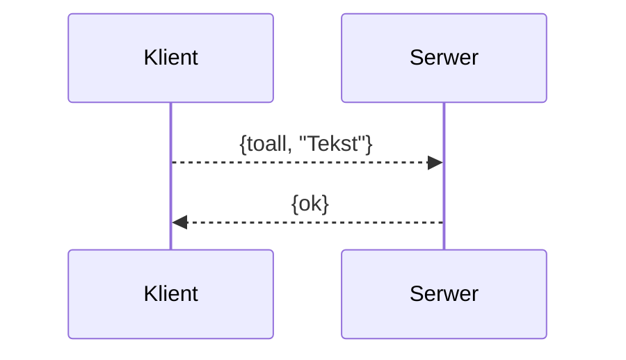

# Protokół


Niniejszy dokument zawiera opis protokołu komunikacyjnego pomiędzy serwerem a klientem.

## Sposób komunkacji

Cała komunikacja odbywa się w środowisku erlang....

## Przesyłane komunikaty

Poniżej znajduje się opis wysyłanych komunikatów ..

### Wysyłanie wiadomości do wszystkich klientów


  
Klient wysyła do serwera wiadomość w postaci .... Jeżeli zapytanie zostało poprawnie przetworzne serwer odpowiada... Jeżeli nastąpił błąd to serwer odpowiada...

### Kolejny komunikat tu opis jak wyżej

  ```mermaid
graph LR
A[Square Rect] -- Link text --> B((Circle))
A --> C(Round Rect)
B --> D{Rhombus}
C --> D
```
