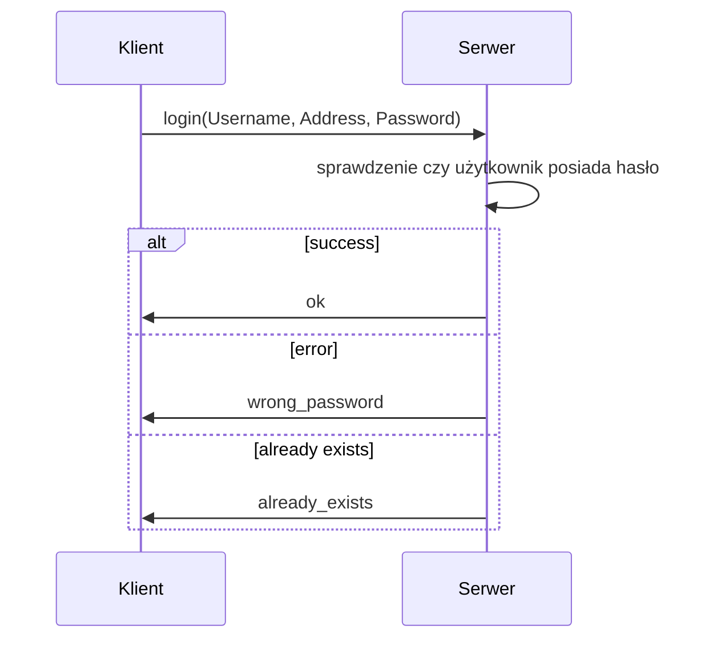
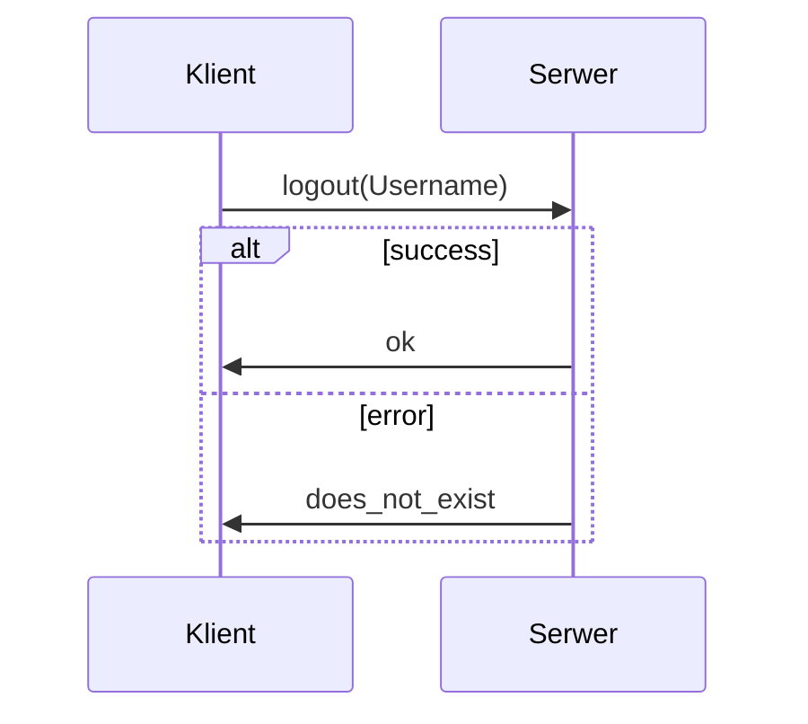
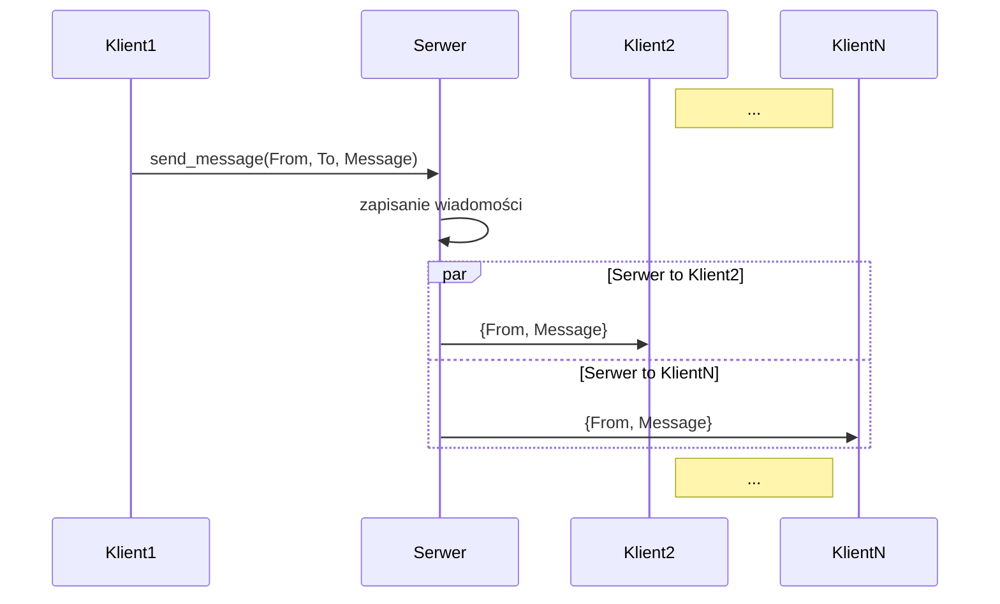
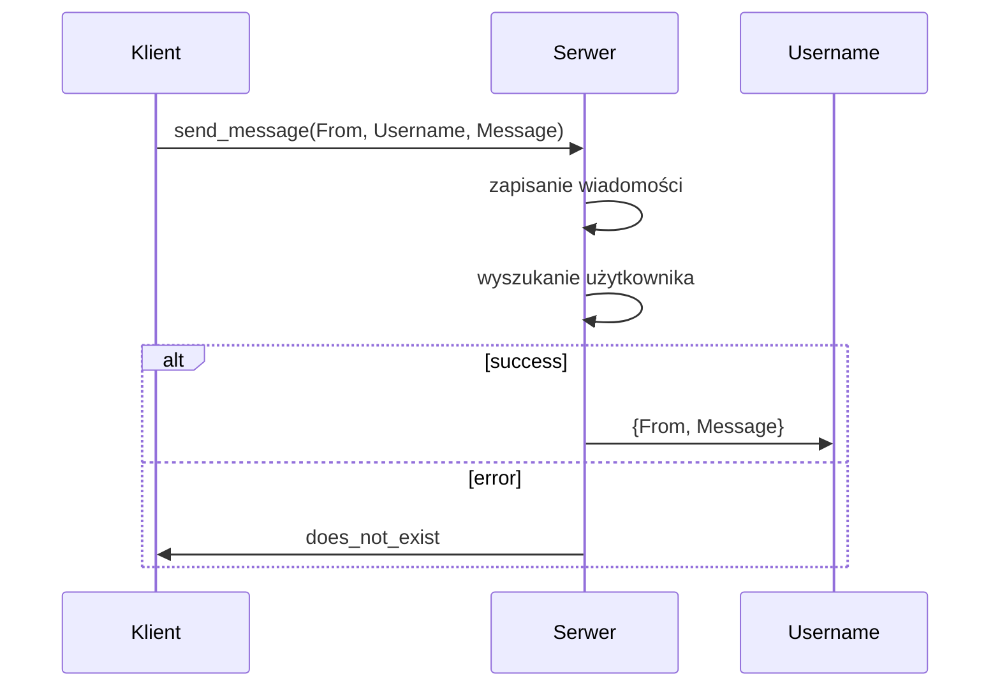
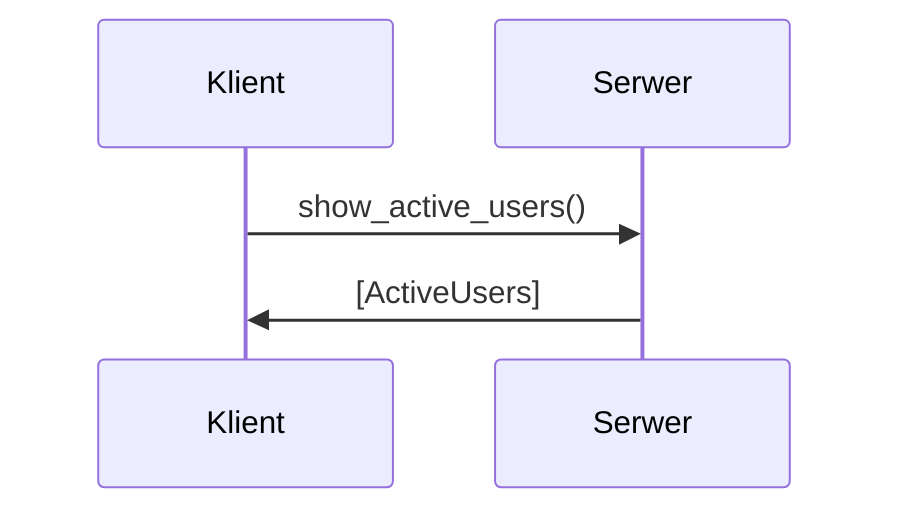
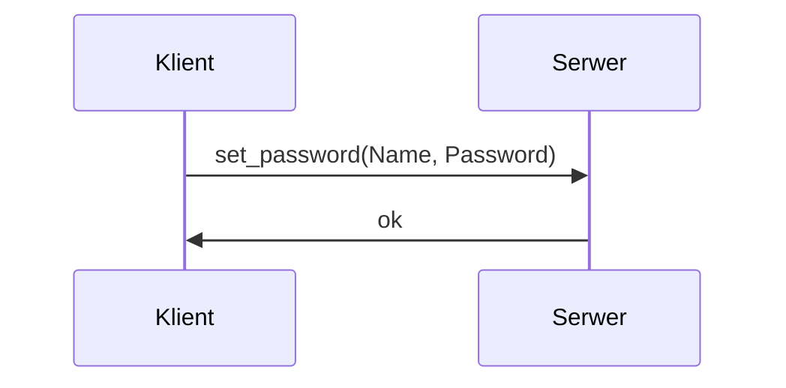

# Protokół

Niniejszy dokument zawiera opis protokołu komunikacyjnego pomiędzy serwerem a klientem.

## Sposób komunkacji

Cała komunikacja odbywa się w środowisku erlang OTP 24.3.4.

## Przesyłane komunikaty

Poniżej znajduje się opis wysyłanych komunikatów.

### login

Klient wysyła do serwera wiadomość w postaci login(Username, Address, Password). Jeżeli zapytanie zostało poprawnie przetworzne, a użytkownik nie posiada hasła serwer odpowiada "ok". Jeżeli użytkownik o podanej nazwie już istnieje serwer odpowie "already_exists". W przypadku kiedy użytkownik posiada hasło, będzie musiał je wpisać zaraz po loginie. Jeżeli hasło będzie poprawne serwer odpowie "ok". Jeśli hasło będzie niepoprawne, serwer odpowie "wrong_password".

### logout

Klient wysyła do serwera wiadomość w postaci logout(Username). Jeżeli zapytanie zostało poprawnie przetworzne, serwer odpowiada "ok". Jeżeli nastąpił błąd to serwer odpowiada "does_not_exist".

### send

Klient wysyła do serwera wiadomość w postaci send_message(From, To, Message). Jeżeli zapytanie zostało poprawnie przetworzne, serwer wysyła wiadomość do wszystkich zalogowanych użytkowników w postaci {From, Message}.

### send Username

Klient wysyła do serwera wiadomość w postaci send_message(From, Username, Message). Jeżeli zapytanie zostało poprawnie przetworzne, serwer wysyła wiadomość do użytkownika {From, Message}. Jeżeli nie ma takiego użytwnika serwer odpowiada "does_not_exist".

### users

Klient wysyła do serwera wiadomość w postaci show_active_users(). W odpowiedzi serwer wysyła [ActiveUsers].

### set_pass

Klient wysyła do serwera wiadomość w postaci set_password(Name, Password). W odpowiedzi serwer wysyła "ok".

