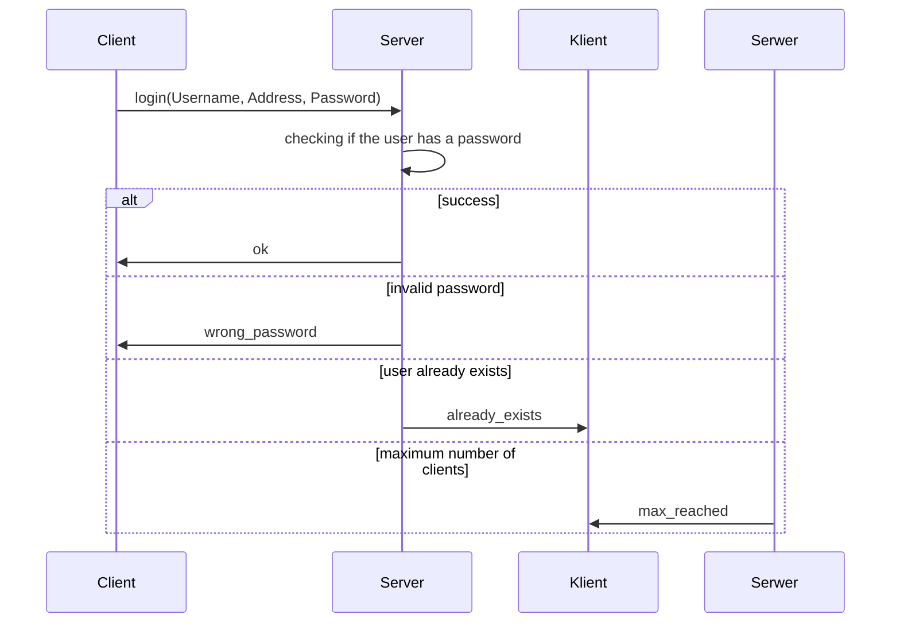
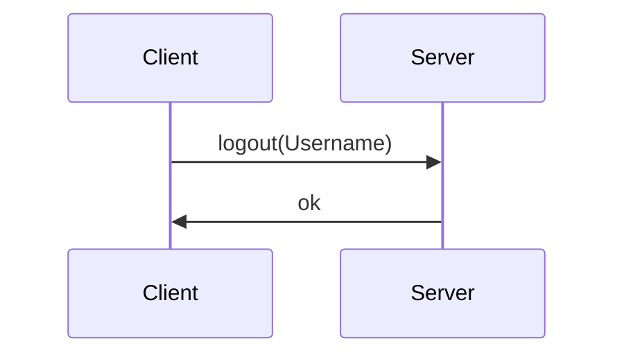
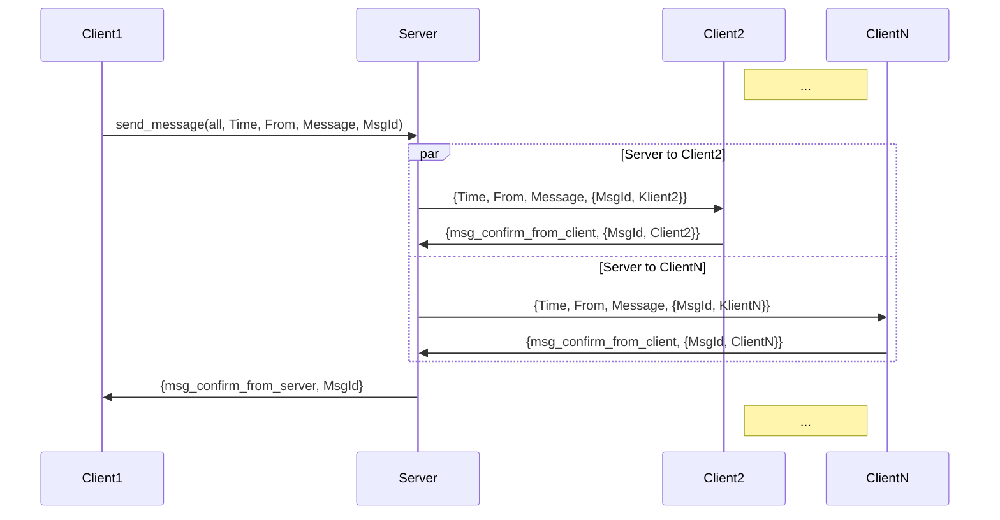
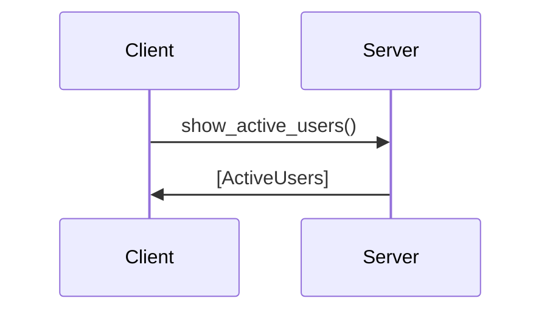
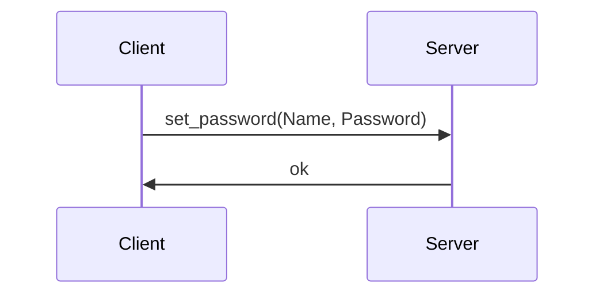
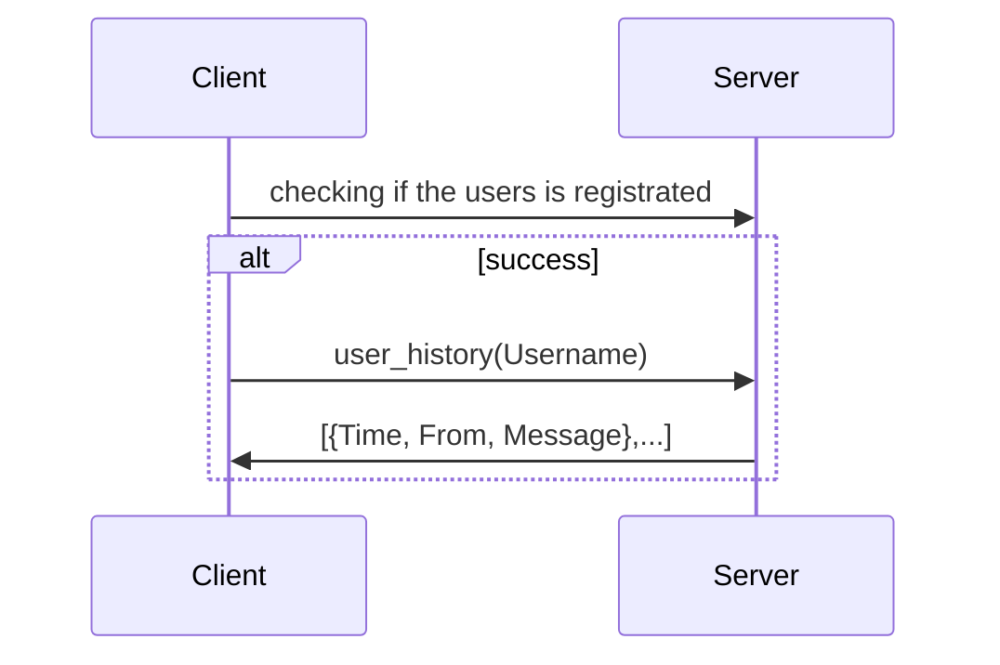

# Protocol

This document demonstrates the communication protocol between the server and the client.

## Way of communication

The communication takes place in the Erlang 24.3.4 environment.

## Sent messages 

Given below is a description of messages that are being sent during the communication.

### login

The client calls the server function in the form of login(Username, Address, Password). If the query has been processed correctly, the server will answer "ok". If the user with a given name already exists, the server will answer "already_exists". If the password is incorrect, the server will answer "wrong_password". If the maximum number of users is reached, the server will answer "max_reached".

### logout

The client calls the server funcition in the form of logout(Username). If the query has been processed correctly, the server will respond "ok".

### send

The client calls the server function in the form of send_message(all, Time, From, Message, MsgId). If the query has been processed correctly, the serber will send a message to all logged in users in the form of {Time, From, Message, {MsgId, ClientN}}.

```mermaid
sequenceDiagram
Client1 ->> Server: wyszukanie użytkownika
alt sukces
Client1 ->> Server: send_message(Username, Time, From, Message, MsgId)
Server ->> Client2: {Time, From, Message, MsgId}
par
Client2->> Server: {msg_confirm_from_client, MsgId}
and
Server ->> Client1: {msg_confirm_from_server, MsgId}
end
else error
Server ->> Client1: does_not_exist
end

```

### send <Username>

Client1 asks the server if the users exists. If so, it calls the server function of the form send_message(Username, Time, From, Message, MsgId). The server forwards the message to Client2 in the form {Time, From, Message, MsgId}, receives confirmation of receiving the message from Client2 in the form {msg_confirm_from_client, MsgId}. Client2 receives confirmation of receiving messages from the server in the form {msg_confirm_from_server, MsgId}. If no such user exists, the server will reply with "does_not_exist".

### users

The client calls the server function in the form of show_active_users(). In response, the server sends [ActiveUsers].

### set_pass

The client calls the server function in the form of set_password(Name, Password). In response, the server sends "ok".

### history

The client calls the server function in the form of user_history(Username). In response, the server sends a list of saved messages in the form [{Time, From, Message}, ...].

